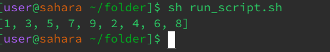
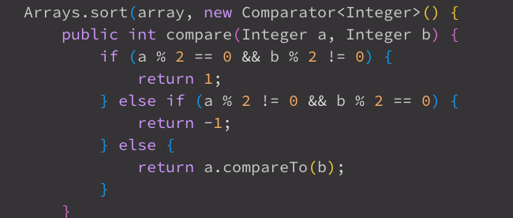
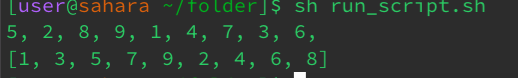

## Original Student Post: ##
Title: Help! Strange behavior in my Java program

Description: Hey everyone, I'm encountering some weird behavior in my Java program. I'm trying to sort an array of integers using a custom comparator, but it's not sorting correctly. Instead, it seems to be sorting only odd numbers at the beginning of the array and even numbers at the end. I've attached a screenshot of the output for reference. Any ideas on what might be causing this?

Screenshot: 
<br>

## TA Response: ##

Thanks for reaching out. It looks like your custom comparator might be causing the issue. Could you please share the code snippet where you're defining the comparator, and also try running the program with a simpler comparator to see if the behavior changes?

Additionally, you can try printing out the sorted array before and after sorting to see if the issue lies within the sorting algorithm itself.

Let me know how it goes!

## Student Response: ##

Thanks for your response. I've attached a screenshot of the code snippet where I define the comparator, as well as the output of the sorted array before and after sorting.

Screenshot: 
<br> 


## TA Response: ##

After examining the code and output, it is clear that the issue lies within the comparator function. The comparator function incorrectly handles the comparison between odd and even numbers, resulting in the observed behavior where odd numbers are sorted before even numbers.

To fix this issue, the comparator function needs to be modified to correctly compare the integers regardless of whether they are odd or even.

File & Directory Structure:

Directory: ~/java_program
Java File: SortArray.java
Bash Script: run_sort.sh
Contents Before Fixing the Bug:

SortArray.java:
```
import java.util.Arrays;
import java.util.Comparator;

public class SortArray {
    public static void main(String[] args) {
        Integer[] array = {5, 2, 8, 9, 1, 4, 7, 3, 6};

        // Custom comparator
        Arrays.sort(array, new Comparator<Integer>() {
            public int compare(Integer a, Integer b) {
                if (a % 2 == 0 && b % 2 != 0) {
                    return 1;
                } else if (a % 2 != 0 && b % 2 == 0) {
                    return -1;
                } else {
                    return a.compareTo(b);
                }
            }
        });

        System.out.println(Arrays.toString(array));
    }
}
```
run_sort.sh:
```
#!/bin/bash

javac SortArray.java
java SortArray

```

Full Command Line to Trigger the Bug:
` ./run_sort.sh `

Bug Fix: 
```
// Custom comparator
Arrays.sort(array, new Comparator<Integer>() {
    public int compare(Integer a, Integer b) {
        return a.compareTo(b);
    }
});
```


Reflection: 
Learning about shortcut commands like tab completion and options in programs like grep has greatly streamlined my workflow and increased my command-line efficiency. During the second half of this quarter, while working on a data processing project, I discovered the potential of regular expressions. Understanding how to utilize regex patterns to search, alter, and extract data from text files has transformed my workflow, allowing me to automate repetitive operations and manage complicated data structures with more efficiency. This newfound talent has not only improved my command-line skills, but it has also broadened my problem-solving abilities in a variety of programming and data analysis settings.
